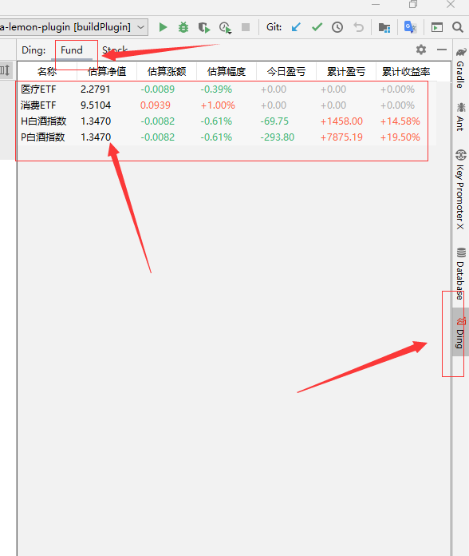
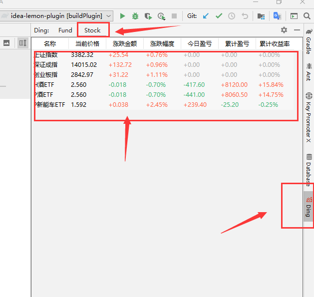
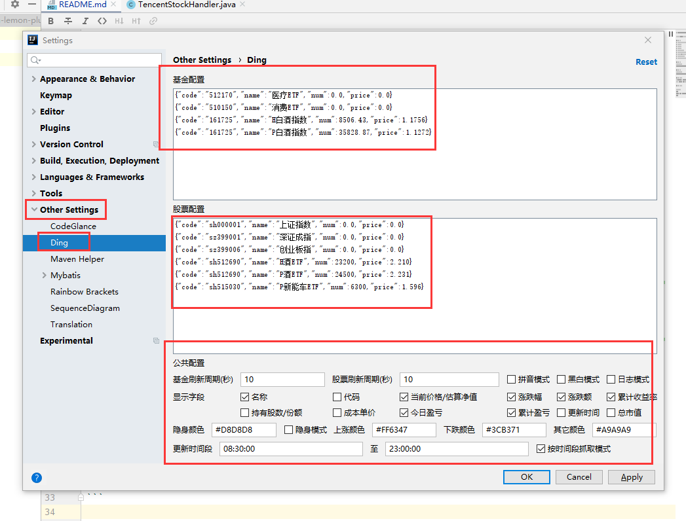

# idea-lemon-plugin

股票基金盯盘IDEA插件。开发者编码盯盘必备。

## 1 功能
- 支持分别自定义股票和基金刷新周期
- 支持拼音模式
- 支持黑白模式
- 支持日志模式
- 支持自定义显示列字段
- 支持隐身模式和隐身模式的颜色
- 支持自定义涨/跌和其它颜色
- 支持固定时间段更新数据
- 支持计算当日盈亏、累计盈亏、总市值、当日收益率、累计收益率等

## 2 基金
数据来源：天天基金



## 3 股票
数据来源：腾讯股票



## 4 打包安装
使用gradle中 intellij --> buildPlugin 进行打包。
然后将 build --> distributions --> idea-lemon-plugin-1.0.0-SNAPSHOT.zip 作为本地插件进行安装即可。

## 5 使用方式
配置设置路径：
```
File --> Setting --> Others Setting --> Ding
```


